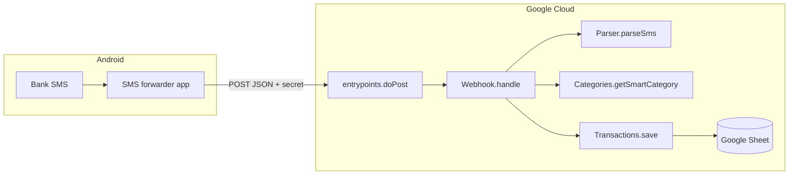

# Architecture

TraFin is a **Google Apps Script** application bound to a **Google Spreadsheet**. All `.js` files are merged into a single global runtime—there is no Node.js server in production.

---

## High-level flow



---

## File map (`src/`)

| File | Namespace / role |
|------|------------------|
| `entrypoints.js` | **Global** triggers only: `doPost`, `onOpen`, `onEdit`, menu wrappers |
| `webhook.js` | `Webhook` — HTTP orchestration, recurring match, JSON response |
| `sms-parser.js` | `Parser` — SMS normalization, extraction, confidence |
| `transactions.js` | `Transactions` — duplicate check, monthly sheet, append |
| `schema.js` | `TxSchema` — column contract, `toRow()`, migration helpers |
| `categories.js` | `Categories` — mapping + rules sheets |
| `sheet.js` | `Sheet` — setup, dropdowns, formatting |
| `settings-sync.js` | `SettingsSync` — refresh dropdowns/balances on settings edit |
| `config.js` | `Config` — timezone, accounts list, ignore keywords; defaults |
| `security.js` | `Security` — webhook secret validation |
| `main.js` | `Main` — init, balances, menu, `onOpen`/`onEdit` bodies |
| `backup.js` | `Backup` — backup + migration |
| `data-guard.js` | `DataGuard` — header verification |
| `dashboard.js` | `Dashboard` — dashboard builder |
| `logging.js` | `Logging` — `Unknown_SMS` sheet |

Root `Code.js` is a legacy stub. Active code is under `src/`.

---

## Entrypoints pattern

Apps Script requires **global function names** for:

- Web app: `doPost`
- Simple triggers: `onOpen`, `onEdit`
- Custom menu: string names like `"initializeProject"`

Pattern:

```javascript
// entrypoints.js
function doPost(e) {
  return Webhook.handle(e);
}
```

All implementation stays in namespaces. **Never** put business logic in `entrypoints.js` beyond one-line delegation.

---

## Webhook pipeline

`Webhook.handle(e)`:

1. Acquire script lock (`LockService`, 30s)
2. Parse JSON body
3. `Security.validateWebhookSecret` — fail closed
4. `Transactions.isDuplicate(smsId)` — cache 6 hours
5. `Parser.parseSms(rawSms, sender)`
6. Reject: ignored, low confidence, missing amount/type
7. `Main.resolveAccountDisplayName` — map parser bank id → sheet display name
8. `Categories.getSmartCategory` — rules from settings sheets
9. `Transactions.save` — `TxSchema.toRow` + `appendRow` + dropdown ensure
10. `Webhook.checkRecurringMatch`
11. JSON response

---

## Parser design

`Parser.parseSms`:

1. `normalizeSms` — spacing, INR, Rs variants
2. `shouldIgnoreSms` — hardcoded marketing/OTP phrases
3. `matchLegacyTxn` — ordered patterns (CC spend, CC payment, debited, credited)
4. Fallback: `detectTxnType`, `extractEntity`, `detectBank`
5. `calculateConfidence` — threshold 0.5 at webhook
6. `autoCategorize` — simple keyword fallback (webhook prefers `Categories`)

Bank detection order:

1. Legacy SMS patterns on **raw** text (`BOI`, `Kotak_CC_{last4}`)
2. Sender id mapping (`HDFCBK` → `HDFC`)
3. SMS body keyword fallback

---

## Transaction persistence

`Transactions.save`:

- `getMonthlySheet` → `Transactions_MMM_yyyy` or create via `Sheet.createMonthlySheet`
- `buildRow` → `TxSchema.toRow(parsed, meta)`
- `append` → `appendRow` + `Sheet.ensureTransactionDropdowns`

### Schema (`TxSchema`)

Fixed column order (do not reorder without migration):

| Col | Header |
|-----|--------|
| A | Timestamp |
| B | Type |
| C | Amount |
| D | Entity |
| E | Category |
| F | Labels |
| G | Bank |
| H | Raw SMS |

Types include `Debit`, `Credit`, `CC_Payment`.

---

## Settings-driven behavior

| Sheet | Runtime use |
|-------|-------------|
| `Settings` | Timezone, ignore keywords |
| `Settings_Categories` | Category dropdown source |
| `Settings_Mapping` | Keyword → category |
| `Settings_Rules` | Time/amount → category |
| `Accounts` / `Accounts_CC` | Bank dropdown + balance SUMIFS |
| `Settings_Recurring` | Auto “Paid” matching |

`SettingsSync.onSettingsChanged` runs on `onEdit` for these sheets → `Sheet.reapplyAllDropdowns` + balance refresh.

Webhook paths read settings **live** each request (no stale cache except duplicate `smsId`).

---

## Data safety

| Principle | Implementation |
|-----------|----------------|
| No delete transaction rows | Append-only webhook |
| No delete sheets in normal ops | Backup may delete duplicate backup tab name |
| Migrations backup first | `Backup.backupAllTransactions` |
| Header repair | `DataGuard.verifyTransactionSheet` |
| Safe re-init | `initializeProject` incremental setup |

---

## Apps Script constraints

| Constraint | Impact |
|------------|--------|
| 6 min execution limit | Keep webhook path fast; avoid full-sheet scans |
| Quotas on UrlFetch, reads/writes | `appendRow` per SMS is acceptable at personal scale |
| No ES modules | Namespace objects + global entrypoints |
| Web app cannot set HTTP status codes easily | Use JSON `status` field |
| `e.headers` often missing | Secret in POST body, not headers |
| All files share global scope | Name collisions break production—use namespaces |

---

## Why no ES modules / npm in production

Apps Script runtime is not Node. `clasp` only **uploads** source files; it does not bundle webpack-style. `import`/`export` are unsupported in the classic V8 runtime project model used here.

---

## Deployment model

```
Local src/  --clasp push-->  Apps Script project  --deploy-->  Web app URL (/exec)
                                      |
                                      v
                            Bound to Spreadsheet
```

- **Execute as:** deploying user (`USER_DEPLOYING`)
- **Access:** `ANYONE_ANONYMOUS` for webhook + secret auth

---

## Extension points (future)

| Area | Direction |
|------|-----------|
| Parser tests | Golden SMS fixtures in CI (external runner) |
| `Config.getIgnoreKeywords` in parser | Sheet-driven ignore list |
| `Recurring` namespace | Move off `Webhook` |
| Column index helpers | `TxSchema.col("Bank")` for SUMIFS builders |
